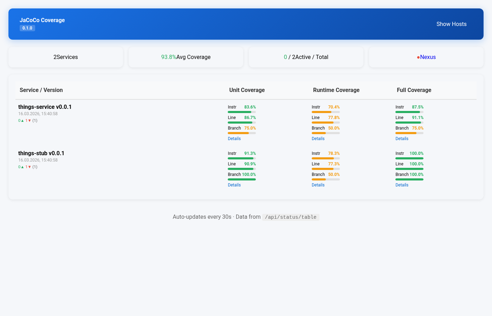

# JaCoCo Coverage Aggregator

Система для сбора, агрегации и публикации данных о покрытии
кода Java‑приложений в runtime.

## Документация

- [docs/architecture.md](docs/architecture.md) – общие
  принципы работы и архитектура.
- [docs/plan.md](docs/plan.md) – детальный план реализации.

## Краткое описание

Проект представляет собой Go‑приложение, которое
периодически опрашивает JVM‑инстансы (микросервисы) с
помощью `jacococli dump`, собирает данные о покрытии
(`.exec`‑файлы), агрегирует их по версиям и сервисам,
генерирует отчёты в форматах HTML/XML/CSV и публикует их
через встроенный веб‑сервер (Chi). Поддерживается
динамическое управление конфигурацией через REST API и
экспорт метрик в Prometheus.

## Быстрый старт

1. Склонируйте репозиторий.
2. Отредактируйте `config.yaml` (см. пример в plan.md).
3. Соберите Docker‑образ с помощью `make docker` (или
   соберите бинарник `make build`).
4. Запустите контейнер:

   ```bash
   docker run -v $(pwd)/config.yaml:/app/config.yaml -p 8080:8080 jacoco-aggregator:latest
   ```

5. Откройте `http://localhost:8080` для просмотра отчётов.



## Пример использования

Для демонстрации работы агрегатора включён пример
Java‑микросервиса (`demo-service-flyway-pg`).

### Вариант 1: Docker-образ с готовыми данными

Соберите и запустите Docker-образ с примерными данными:

1. Соберите Docker-образ с примерными данными:

   ```bash
   make build-example
   ```

2. Запустите контейнер:

   ```bash
   docker run -p 8080:8080 jacoco-aggregator-example
   ```

### Вариант 2: Запуск примерных сервисов локально

Запустите примерные сервисы через docker compose и
подключите агрегатор:

1. Запустите примерные сервисы (клонирует репозиторий,
   собирает и запускает контейнеры):

   ```bash
   make start-example-stand
   ```

2. Запустите агрегатор:

   ```bash
   make start-example
   ```

3. Откройте `http://localhost:8080` для просмотра отчётов.

4. По окончании остановите примерные сервисы:

   ```bash
   make stop-example-stand
   ```

### Доступные команды Make

- `make start-example-stand` – клонирует репозиторий
  примера, собирает сервисы и запускает docker compose
- `make start-example` – запускает агрегатор с примерной
  конфигурацией
- `make stop-example-stand` – останавливает docker compose
  сервисы

## Разработка

Проект использует Makefile для автоматизации типичных задач:

- `make test` – запуск модульных и интеграционных тестов (с
  использованием `testify`).
- `make lint` – проверка кода линтером (`golangci-lint`).
- `make coverage` – генерация отчёта о покрытии кода самого
  агрегатора (цель – не менее 80%).
- `make build` – сборка бинарного файла в `bin/aggregator`.
- `make docker` – сборка Docker‑образа
  `jacoco-aggregator:latest`.

Для запуска тестов с покрытием выполните `make coverage`;
отчёт будет сохранён в `coverage.out` и выведен в терминал.

Перед коммитом рекомендуется выполнить `make lint` и
`make test`.

## Требования

**Важно:** Для сбора данных о покрытии микросервисы должны
запускаться с Java‑агентом JaCoCo:

```bash
java -javaagent:jacocoagent.jar=destfile=jacoco.exec,address=0.0.0.0 -jar your-service.jar
```

Порт 6300 должен быть открыт для подключения агрегатора к
агенту JaCoCo.

- Docker
- Java 8+ (для работы `jacococli`)
- Go 1.21+ (для сборки из исходников)
- Maven (для сборки примера через `make build-example`)

## Лицензия

MIT
