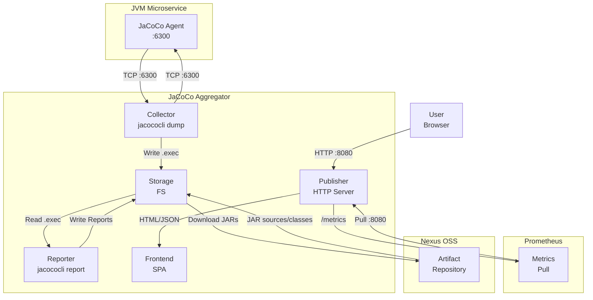

# JaCoCo Coverage Aggregator Agent - Общие принципы

## Обзор
Этот проект реализует распределённую систему сбора данных о покрытии кода для Java‑приложений с использованием JaCoCo. Система периодически опрашивает несколько JVM‑инстансов (микросервисов), собирает данные о покрытии, агрегирует их по нескольким запускам, формирует сводные отчёты и публикует их в виде статического веб‑сайта.

## Основные принципы

### 1. Разделение ответственности
- **Сборщик (Collector)**: Отвечает за опрос каждого целевого JVM‑инстанса с помощью `jacococli dump` для получения данных о покрытии (файлы `.exec`).
- **Генератор отчётов (Reporter)**: Использует `jacococli report` для создания HTML‑отчётов из агрегированных данных.
- **Публикатор (Publisher)**: Упаковывает сгенерированные отчёты в статический веб‑сайт и обслуживает их через встроенный Go‑веб‑сервер (роутер Chi).

### 2. Конфигурация
- Все целевые инстансы определяются в конфигурационном файле (YAML/JSON/TOML).
- Конфигурация включает:
  - Идентификаторы инстансов
  - Данные подключения (хост, порт) для использования в `jacococli dump`
  - Интервалы опроса
  - URL для загрузки исходных JAR‑файлов (опционально)
  - Пути к исходному коду и class‑файлам (монтируются в контейнер)

### 3. Идемпотентность и отказоустойчивость
- Каждый цикл опроса независим; сбои в одном инстансе не блокируют остальные.
- Собранные данные хранятся временно; агрегацию можно повторять без потери данных.
- Система должна логировать ошибки и продолжать работу.

### 4. Бессостоятельность
- Агрегатор не сохраняет постоянное состояние между запусками (кроме кэширования).
- Все данные о покрытии хранятся в виде файлов (`.exec`, отчёты) в чётко определённой структуре каталогов.

### 5. Контейнерный дизайн
- Вся работа приложения выполняется внутри Docker‑контейнера.
- Контейнер включает:
  - Go‑бинарник
  - Инструменты JaCoCo CLI (`jacococli.jar`)
  - Java runtime (если требуется для `jacococli`)
  - Конфигурационные файлы
  - Исходные JAR‑файлы (загружаются из настроенных URL) для генерации отчётов
  - **Первичные файлы покрытия (baseline `.exec`)** – для каждой версии сервиса можно загрузить начальный файл покрытия, который будет использоваться как основа для агрегации (например, из артефактов сборки).
- Контейнер может быть развёрнут в любой оркестрационной среде (Kubernetes, Docker Compose и т.д.).

## Технологический стек
- **Язык реализации**: Go (выбран за простоту, поддержку конкурентности и малый размер)
- **Frontend**: React + TypeScript + Vite + @gravity-ui/uikit
- **Инструмент покрытия**: JaCoCo (Java Code Coverage) – отраслевой стандарт для Java
- **Оркестрация**: Docker, опционально Kubernetes для масштабирования
- **Конфигурация**: YAML (удобочитаемость и простота)
- **Формат отчётов**: HTML (предоставляемые JaCoCo)
- **Веб‑сервер**: Встроенный Go‑сервер на роутере Chi для раздачи статических отчётов и, опционально, предоставления API‑эндпоинтов.
- **Тестирование**: Использование библиотеки `testify` для модульных и интеграционных тестов, проверка покрытия кода самого агрегатора (цель – не менее 80%).

## Рабочий процесс

### Описание взаимодействия

| Компонент | Порт | Протокол | Описание |
|-----------|-----|----------|---------|
| JaCoCo Agent | 6300 | TCP | Java-агент, запущенный с микросервисом |
| Aggregator HTTP | 8080 | HTTP | Веб-сервер агрегатора |
| Aggregator → Agent | 6300 | TCP | Опрос агента через `jacococli dump` |
| Prometheus → Aggregator | 8080 | HTTP | Прометеус забирает метрики |
| Storage → Nexus | 8081 | HTTP | Загрузка JAR-файлов (sources/classes) |

### Детали протоколов

- **Collector → Agent**: TCP socket, `jacococli dump` подключается к агенту по адресу `host:port`
- **Publisher → User**: HTTP/HTTPS, отдаёт HTML-отчёты и API
- **Prometheus → Publisher**: HTTP, прометеус опрашивает `/metrics` эндпоинт

### Рабочий процесс

1. **Загрузка конфигурации**: Чтение списка целевых инстансов из конфигурационного файла.
2. **Цикл опроса**: Для каждого инстанса выполняется `jacococli dump` для получения текущего снимка покрытия.
3. **Хранение данных**: Каждый снимок сохраняется как датированный файл `.exec` во временном каталоге.
4. **Агрегация**: После сбора всех снимков они объединяются с помощью `jacococli merge` (или собственной логики слияния).
5. **Генерация отчёта**: Запуск `jacococli report` на объединённом файле `.exec` с использованием путей к исходному коду и class‑файлам из конфигурации.
6. **Публикация**: Копирование сгенерированных HTML‑отчётов в каталог веб‑сервера (например, `/var/www/coverage`).

## Точки интеграции
- **CI/CD‑пайплайны**: Может запускаться после деплоя для сбора покрытия с работающих сервисов.
- **Мониторинг**: Метрики (количество покрытых строк, процент покрытия) могут экспортироваться в Prometheus.
- **Оповещения**: Уведомление о падении покрытия ниже заданного порога.
- **Nexus OSS**: Загрузка JAR-артефактов (исходников и классов) для генерации отчётов с исходным кодом.

## API Endpoints

| Endpoint | Метод | Описание |
|----------|-------|---------|
| `/api/status/table` | GET | Таблица статусов покрытия всех сервисов |
| `/api/version` | GET | Версия приложения |
| `/api/instances` | GET | Список инстансов |
| `/api/instances` | POST | Добавить инстанс |
| `/api/instances/status` | GET | Статусы опроса инстансов |
| `/api/reports/{service}/{version}/{type}/*` | GET | Отчёты (HTML) |
| `/metrics` | GET | Prometheus метрики |

## Возможные расширения
- REST API для ad‑hoc сбора и генерации отчётов.
- Дашборд с историческими трендами.
- Поддержка других инструментов покрытия (например, Clover, Cobertura).
- Распределённое хранение данных покрытия (S3, база данных).

---
*Этот документ будет обновляться по мере развития проекта.*